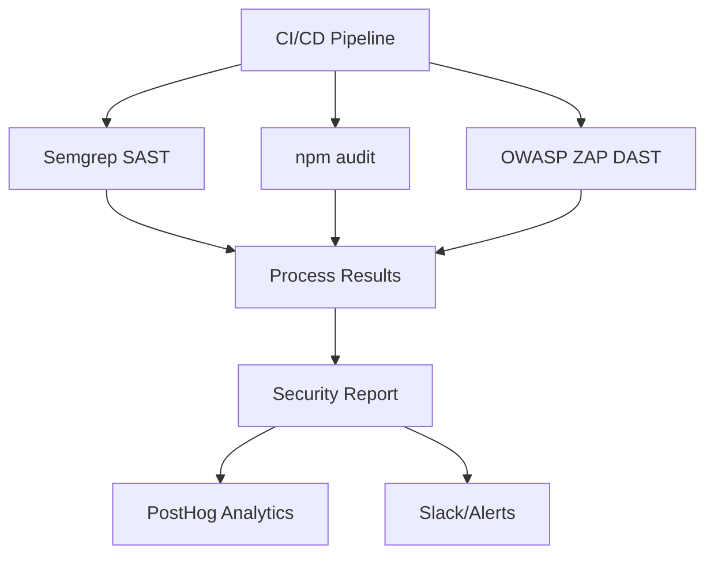

# Task 98 Implementation Plan: Security Scanning in CI/CD (OWASP ZAP, Semgrep, npm audit)

---

## [2025-07-11] Implementation Status & Discoveries (AI Agent Log)

### Current State (as of this review)

- **CI/CD Workflows:**
  - `.github/workflows/security.yml` exists but **all security jobs are currently disabled** (MVP focus). Only a no-op job runs; all actual security jobs (dependency audit, static code analysis, reporting) are commented out.
  - `.github/workflows/secret-scan.yml` is active and scans for secrets/API keys on every push/PR using grep patterns. It fails the job if a secret is detected. No integration with Semgrep, npm audit, or ZAP.
  - No workflows for Semgrep SAST, npm audit, or OWASP ZAP DAST are currently active or present.

- **Scripts Directory (`scripts/`):**
  - No scripts named `process-semgrep-results.js`, `process-audit-results.js`, or `process-zap-results.js` are present.
  - No script for PostHog logging of security events (`security-events.ts`).
  - Existing scripts are for validation, setup, and JWT generation only.

- **Documentation:**
  - This file (task-98-security-scanning-cicd.md) is up to date with the intended plan, but the actual implementation is not yet in place.

### Gaps Identified

- **Semgrep SAST:** Not present in CI/CD.
- **npm audit:** Not present in CI/CD.
- **OWASP ZAP DAST:** Not present in CI/CD.
- **Result processing scripts:** Not present in `scripts/`.
- **PostHog/Slack integration:** Not present for security events.
- **Secret scanning:** Present and active.

### Next Steps (Planned Actions)

1. **Reactivate and implement security jobs in `security.yml`:**
   - Add jobs for Semgrep, npm audit, and ZAP as per the implementation plan below.
2. **Create scripts in `scripts/`:**
   - `process-semgrep-results.js`
   - `process-audit-results.js`
   - `process-zap-results.js`
   - `security-events.ts` (for PostHog logging)
3. **Update this documentation** as changes are made and reference new rules, exceptions, or process changes.

---

## Pre-Implementation Checklist

Before starting any phase of Task 98, ensure the following are addressed to align with TaskMaster, PRD, and security best practices:

- [ ] **CI/CD pipeline is accessible and modifiable**
  - Confirm access to GitHub Actions, GitLab CI, or your chosen CI/CD system.
  - Ensure secrets (API keys, tokens) are securely managed.
- [ ] **OWASP ZAP, Semgrep, and npm audit dependencies are available**
  - Add `returntocorp/semgrep:latest` and `zaproxy/action-api-scan` to pipeline.
  - Ensure Node.js version compatibility for npm audit.
- [ ] **API endpoints and OpenAPI/Swagger specs are up-to-date**
  - Export latest API schema for ZAP scanning.
- [ ] **PostHog API key and endpoint are configured for event logging**
  - Store in CI/CD secrets, not in code.
- [ ] **Slack or alerting integration is available for critical vulnerability notifications**
- [ ] **Security scanning scripts/utilities are version-controlled**
  - Place in `scripts/` directory (e.g., `process-semgrep-results.js`, `process-zap-results.js`).
- [ ] **Test environments (staging, main) are available for safe scanning**
- [ ] **Documentation and update process for security scanning is outlined**
  - Plan to document in this file and reference in onboarding.

---

## Purpose & PRD Alignment

This document establishes a robust, automated security scanning process for the CI/CD pipeline, supporting:

- **PRD References:**
  - Section 7.2: Security (vulnerability detection, XSS/SQLi prevention)
  - Section 8.6: Monitoring/logging (PostHog integration)
  - Section 12: Metrics (security, trust)
  - Section 13.1: Testing (automated, evidence-based)
- **Goals:**
  - Detect vulnerabilities (XSS, SQLi, insecure dependencies) before production.
  - Automate actionable security reporting and analytics.
  - Ensure all findings are logged and tracked for continuous improvement.

---

## Scope & Out of Scope

**In Scope:**
- Semgrep static analysis (SAST) for Node.js/TypeScript
- OWASP ZAP dynamic API scanning (DAST)
- npm audit for dependency vulnerabilities
- Automated reporting and PostHog event logging
- Slack/alerting for critical issues

**Out of Scope:**
- Manual penetration testing
- Frontend-only security scanning
- Analytics beyond security events

---

## Architecture Overview

- **CI/CD Pipeline:** Orchestrates all scans and reporting.
- **Semgrep:** Runs pre-build static analysis with TypeScript, Node.js, and OWASP Top Ten rules.
- **npm audit:** Checks dependencies for known vulnerabilities during build.
- **OWASP ZAP:** Performs post-build API scanning using OpenAPI specs.
- **Scripts:** Process scan results, generate reports, and log events to PostHog.
- **PostHog:** Receives `security_scan` events for analytics and dashboards.
- **Slack/Alerts:** Notifies on critical vulnerabilities.

**Diagram:**


---

## Implementation Phases & Phase Gates

### 1. Semgrep Static Analysis (SAST)

> **Phase Gate:** Semgrep runs on all PRs and pushes. Custom and standard rules are configured. Results are processed and logged.

**Success Criteria:**
- Semgrep scans all backend code for vulnerabilities.
- Custom rules for project-specific risks (e.g., webhook validation).
- Results output as JSON and processed for analytics.

**Example (GitHub Actions):**
```yaml
name: Semgrep Security Scan
on: [push, pull_request]
jobs:
  semgrep:
    runs-on: ubuntu-latest
    container:
      image: returntocorp/semgrep:latest
    steps:
      - uses: actions/checkout@v4
      - name: Semgrep Scan
        run: |
          semgrep ci \
            --config "p/typescript" \
            --config "p/nodejs" \
            --config "p/owasp-top-ten" \
            --output semgrep-results.json \
            --json
        env:
          SEMGREP_APP_TOKEN: ${{ secrets.SEMGREP_APP_TOKEN }}
      - name: Process Results
        run: |
          node scripts/process-semgrep-results.js
```

---

### 2. Dependency Scanning (npm audit)

> **Phase Gate:** npm audit runs on all builds. Results are processed and logged.

**Success Criteria:**
- All dependencies are checked for vulnerabilities.
- Results are parsed and included in security reports.

**Example (GitHub Actions):**
```yaml
name: Dependency Security Scan
on: [push, pull_request]
jobs:
  audit:
    runs-on: ubuntu-latest
    steps:
      - uses: actions/checkout@v4
      - name: Setup Node.js
        uses: actions/setup-node@v4
        with:
          node-version: '20'
      - name: Run npm audit
        run: |
          npm audit --json > audit-results.json || true
      - name: Process Audit Results
        run: |
          node scripts/process-audit-results.js
```

---

### 3. OWASP ZAP API Scanning (DAST)

> **Phase Gate:** ZAP runs on main/staging branches and on schedule. Auth and OpenAPI config are validated. Results are processed and logged.

**Success Criteria:**
- ZAP scans all API endpoints using latest OpenAPI spec.
- Authenticated endpoints are tested.
- Results are output as JSON and processed for analytics.

**Example (GitHub Actions):**
```yaml
name: OWASP ZAP API Scan
on:
  push:
    branches: [ main, staging ]
  schedule:
    - cron: '0 0 * * *'
jobs:
  zap_scan:
    runs-on: ubuntu-latest
    steps:
      - name: Checkout
        uses: actions/checkout@v4
      - name: ZAP API Scan
        uses: zaproxy/action-api-scan@v0.5.0
        with:
          target: 'https://api.staging.yourapp.com'
          format: 'json'
          cmd_options: '-c config.yaml'
          allow_issue_writing: true
          fail_action: false
      - name: Process ZAP Results
        run: |
          node scripts/process-zap-results.js
```

---

### 4. Automated Reporting & PostHog Integration

> **Phase Gate:** All scan results are aggregated, summarized, and logged to PostHog. Critical issues trigger alerts.

**Success Criteria:**
- Security reports are generated for each pipeline run.
- `security_scan` events are sent to PostHog with scan type, vulnerability counts, severity, and duration.
- Slack/alerting is triggered for critical vulnerabilities.

**Example (TypeScript):**
```typescript
// scripts/security-events.ts
import { PostHog } from 'posthog-node';
const posthog = new PostHog(process.env.POSTHOG_API_KEY);
export const logSecurityScan = async (scanType: string, results: any) => {
  await posthog.capture({
    distinctId: 'system',
    event: 'security_scan',
    properties: {
      scan_type: scanType,
      vulnerability_count: results.vulnerabilities.length,
      high_severity_count: results.highSeverityCount,
      scan_duration: results.duration,
      failed_checks: results.failedChecks,
      timestamp: new Date().toISOString()
    }
  });
};
```

---

### 5. Continuous Improvement & Maintenance

> **Phase Gate:** All findings are tracked, documentation is updated, and the process is reviewed quarterly.

**Success Criteria:**
- All vulnerabilities are triaged and tracked to resolution.
- Documentation is updated with new rules, exceptions, and lessons learned.
- Quarterly review of scanning effectiveness and coverage.

---

## Best Practices / Nuggets of Gold

- **Automate Everything:** Run all scans on every PR and main branch push.
- **Fail Fast:** Block merges on high/critical vulnerabilities.
- **Custom Rules:** Add project-specific Semgrep rules for business logic risks.
- **Evidence-Based:** Log all scan results and remediation actions.
- **Alerting:** Notify immediately on critical issues.
- **Documentation:** Keep this file and onboarding docs up to date.
- **Performance:** Use caching and parallelization to keep pipelines fast.
- **Separation of Secrets:** Never expose API keys or tokens in logs or reports.

---

## Known Pitfalls & Gotchas

- **False Positives:** Review and tune rules to avoid alert fatigue.
- **Missed Auth:** Ensure ZAP is configured for authenticated endpoints.
- **Outdated Specs:** Keep OpenAPI/Swagger docs current for accurate scanning.
- **Untracked Findings:** Always log and triage vulnerabilities.
- **Pipeline Slowdown:** Optimize scan order and parallelize where possible.
- **Scope Creep:** Stick to backend/API scanning—frontend handled separately.

---

## Environment Variables & Secrets

| Variable Name         | Description                                 |
|----------------------|---------------------------------------------|
| `POSTHOG_API_KEY`    | PostHog API key for event logging           |
| `SEMGREP_APP_TOKEN`  | Semgrep App token for CI/CD authentication  |
| `ZAP_AUTH_TOKEN`     | Bearer token for ZAP authenticated scans    |
| `SLACK_WEBHOOK_URL`  | Slack webhook for critical alerts           |

**Best Practices:**
- Store all secrets in CI/CD environment, not in code or logs.
- Rotate keys regularly and document their locations.

---

## Documentation & Update Process

- Document all scan rules, exceptions, and findings in this file.
- Reference this doc in onboarding and security training.
- Use PR review for all changes to scanning configuration or rules.
- Update this doc whenever new tools, rules, or alerting channels are added.

---

## References

- PRD.md (Sections 7.2, 8.6, 12, 13.1)
- [OWASP ZAP Documentation](https://www.zaproxy.org/docs/)
- [Semgrep Documentation](https://semgrep.dev/docs/)
- [npm audit Documentation](https://docs.npmjs.com/cli/v8/commands/npm-audit)
- [PostHog Node SDK](https://posthog.com/docs/libraries/node)
- [GitHub Actions Docs](https://docs.github.com/en/actions)
- [Slack Webhooks](https://api.slack.com/messaging/webhooks)

---

**Last updated:** 2025-07-11